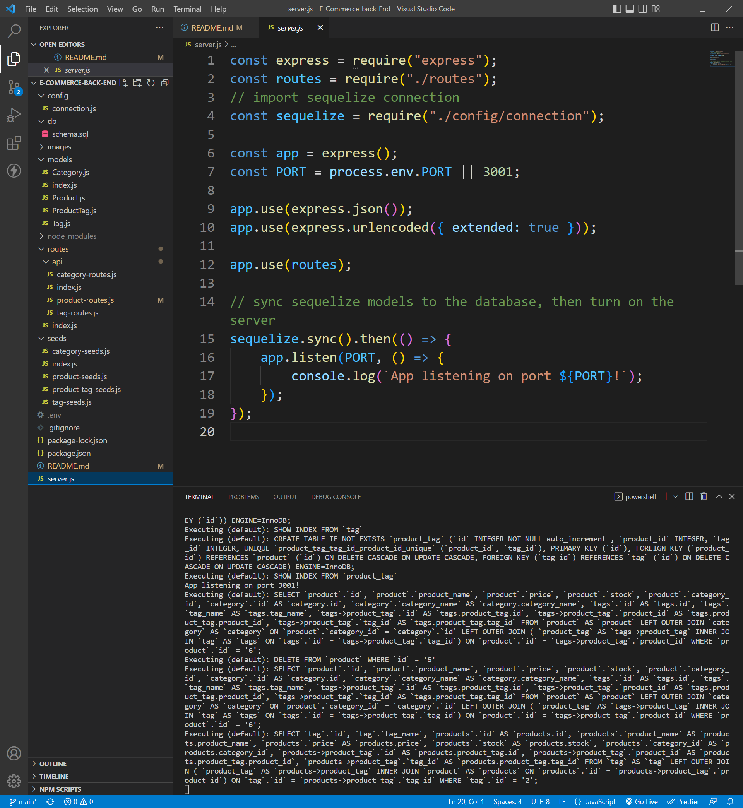
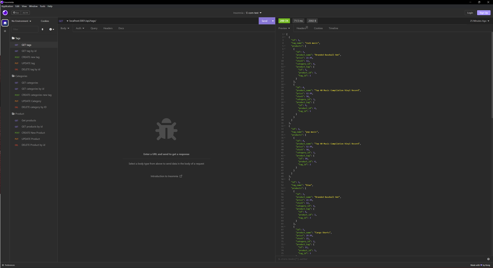
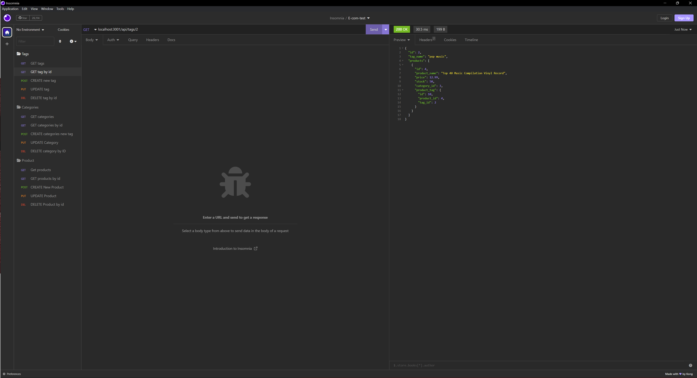
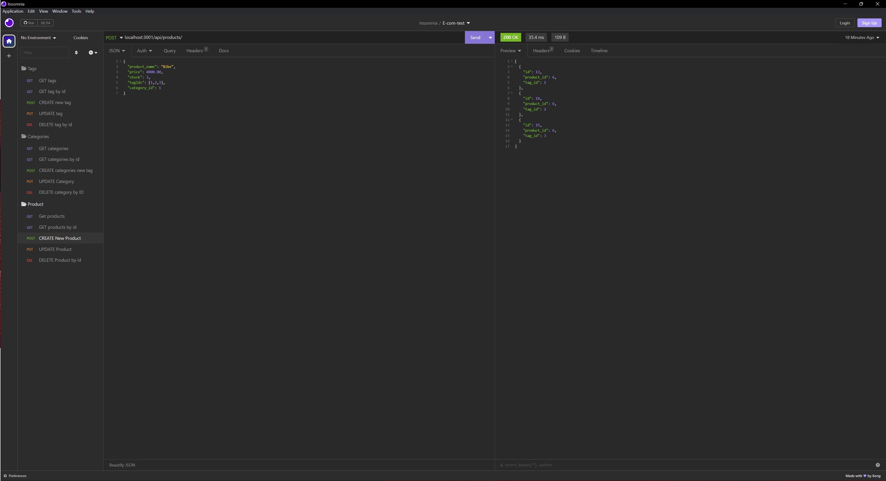

# E-commerce Back End

## Decription

The motivation for this project was to build a e-commerce back end for a e-commerce website that uses the latest technologies to help the company stay competitive with other e-commerce companies.

The project uses Express.js API using Sequelize to interact with a MySQL database through associations:

-   Product database belongs to Category database, as a category can have multiple products but a product can only belong to one category.

-   Category has many Product models.

-   Product belongs to many Tag models. Using the ProductTag through model, allow products to have multiple tags and tags to have many products.

-   Tag belongs to many Product models.

## Walkthrough video

## Screenshots

## Usage

Please run the following commands in the project root of the project:

1. npm i
2. mysql -u root -p
3. source db/schema.sql
4. node seeds/index.js
5. npm start
